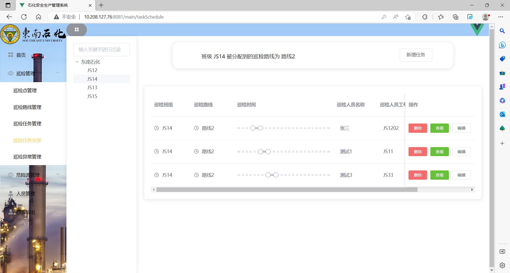
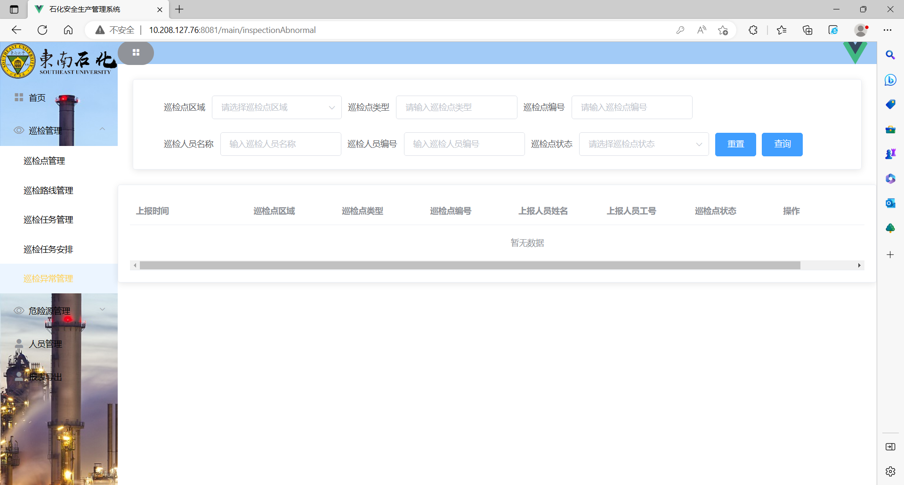
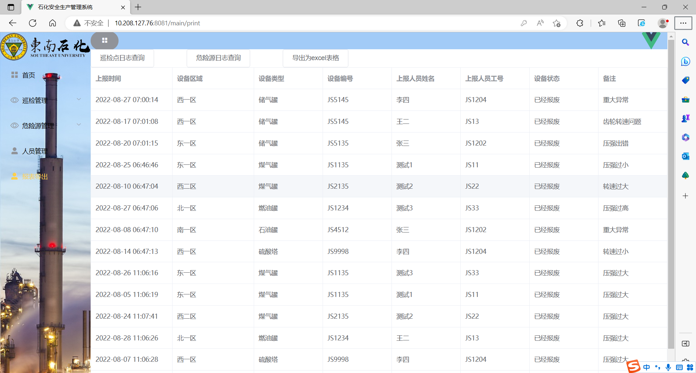

# 东南石化工业安全生产管理平台

## 一、项目介绍
基于Vue，SpringBoot，MySQL的安全生产管理平台。

本项目旨在降低石化行业的危险事故发生率，通过巡检人员在APP端上传巡检点信息以及相关物联网危险源设备实时上传传感器数据到系统，管理者可在PC端实时查看工厂设备运作情况，一旦发生隐患，可以及时预防，将安全事故的发生率降低最低。该项目为2022年8-9月卓工班暑期实训项目，项目开发时间为两周，最终综合评分荣获第一名。

## 二、运行截图

